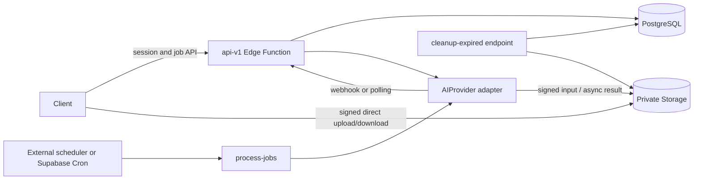

# Backend architecture

The backend is a Supabase-oriented orchestration layer. Clients call the `api-v1` Edge Function, upload bytes directly to the private `media-assets` bucket, and poll job state. PostgreSQL is the source of truth. Heavy image/video work always runs behind an `AIProvider` adapter; Edge Functions only validate, submit, poll, finalize, and issue signed URLs.

`api-v1` is a versioned router whose canonical hosted base is `/functions/v1/api-v1`. `process-jobs` atomically claims queued jobs and polls processing jobs, up to 50 rows per invocation. `cleanup-expired` performs bounded, idempotent retention cleanup. These are protected endpoints, not automatically scheduled until the deployment operator configures the scheduler described in `scheduler.md`. A service-role client exists only inside Edge Functions. Database tables are RLS-enabled with all direct grants revoked from `anon` and `authenticated`.

The mock provider encodes submit time and failure mode in an opaque job ID, so it remains asynchronous without an external service or in-memory state. The only real adapter is fal.ai. It submits a temporary signed source URL to the fal queue, stores the fal request ID, polls status/result, downloads the PNG server-side, and copies it into a new private asset; originals and prior versions are never overwritten.
