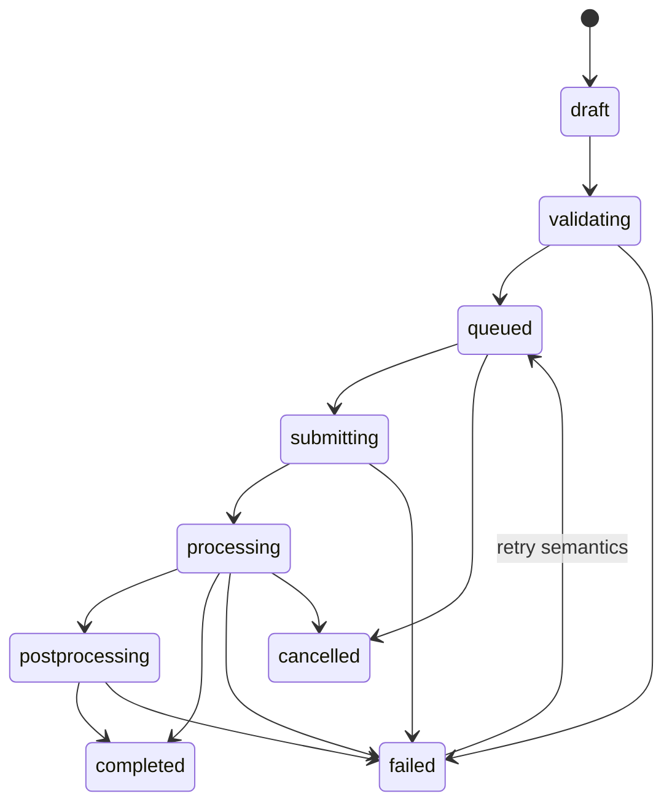

# Job state machine

Allowed application transitions:

`completed`, `cancelled`, and `expired` are terminal. Retention cleanup is the sole administrative path that marks unfinished/failed jobs `expired`. Normal transitions use the `transition_job_status` RPC with an expected current state; a concurrent or invalid transition changes nothing and returns a controlled error. Retry creates a new job and leaves the failed parent unchanged.

Provider-reported percentages are stored only when supplied. The API returns `null` rather than inventing precision.
